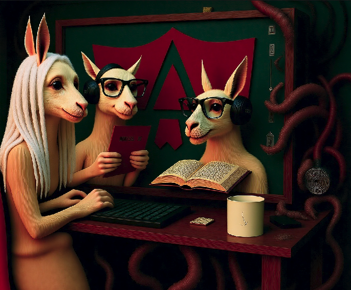

## RAG Project

This is my first project using AI. It's a simple RAG (Retrieval-Augmented Generation) model that utilizes a vector database. By querying the database, users can ask questions about the information provided to the system. To use this program, you first need to install Ollama on your computer.

---

**Architecture**
The architecture of this project consists of a simple program with separate backend and frontend services:
- **Backend**: The backend is architected as a collection of distinct Docker containers, each responsible for a specific functionality. This modular design promotes scalability, maintainability, and independent deployment. The core components are:

   * **Database Service (MySQL):** This containerized service manages database interactions. It's built using the `mysql` image (and a separate container for PostgreSQL, as defined in the `docker-compose.yml`).  The `db_service` container, built from the `./ddbb` directory, acts as a connector to the database, handling queries and data retrieval. It's configured to connect to MySQL and provides an API (port 8001) for other services to interact with the database.  It leverages environment variables from `./ddbb/.env` for configuration.  It's dependent on the `db` container for database availability. **[View README to DataBase Manager](./ddbb/README.md)**

   * **PDF Document RAG (Retrieval-Augmented Generation):**  This container, built from the `./RAG_documents` directory, focuses on processing PDF documents for RAG. It handles tasks such as OCR (Optical Character Recognition) using appropriate algorithms to extract text from images within PDFs.  The extracted text is then embedded into a vector database (ChromaDB) and stored. This container exposes an API on port 8000.  `network_mode: host` is used to allow direct access to host network resources like ollama as provider of LLM models. It utilizes volumes to persist data and store conversation history.  **[View README to RAG PDF](./RAG_documents/README.md)**

   * **Database RAG (PostgreSQL & MySQL):** This container, built from the `./RAG_ddbb` directory, is dedicated to interacting with relational databases (PostgreSQL and MySQL). It executes queries against the databases and prepares the results for use in the RAG process.  The results of these queries are then embedded into a vector database (ChromaDB) and stored. This container exposes an API on port 8002 and also uses `network_mode: host` for direct access to host network resources. It utilizes volumes to persist data and store database configurations. **[View README to RAG DataBases](./RAG_ddbb/README.md)**

   * **Conversational Chatbot:** This container, built from the `./chatbot` directory, houses the chatbot's logic. It receives user queries, formulates them, and leverages the PDF Document RAG and Database RAG services to retrieve relevant information.  It then utilizes an LLM (Large Language Model) hosted on Ollama to generate a coherent and conversational response.  The chatbot manages conversation state and history.  It exposes an API on port 8003 and uses a volume to store conversation history. `network_mode: host` is used to allow direct access to host network resources. **[View README to Chatbot Backend](./chatbot/README.md)**

   **Communication:**  The containers communicate with each other via their respective APIs. The PDF Document RAG and Database RAG containers send queries to the appropriate database service. The Chatbot container then consumes the results from these services to generate responses.  The use of Docker volumes ensures data persistence across container restarts.  The `network_mode: host` setting allows the containers to directly access host network resources, simplifying inter-container communication.

- **Frontend**: The frontend is built using the Angular framework, a comprehensive TypeScript-based framework for building dynamic and interactive web applications. This approach allows for a modular and maintainable codebase, crucial for a complex application centered around chatbots and data retrieval. The frontend is composed of several reusable components, designed to streamline development and ensure consistency across all screens.

The application features the following screens:

* **Login Screen:**  This screen allows users to securely authenticate and access the application. It includes fields for username  and password, along with login and registration functionalities.
* **Main Menu:** This is the central navigation hub of the application. It provides access to the core services:
    * **Chatbot Service:**  Allows users to interact with the conversational chatbot for general queries to models.
    * **Database RAG (Retrieval-Augmented Generation):** Enables users to query and retrieve information from connected databases (PostgreSQL and MySQL).
    * **PDF RAG (Retrieval-Augmented Generation):**  Allows users to upload PDF documents and query their content using the chatbot.

The Angular framework's component-based architecture is particularly well-suited for this project because the core logic revolves around chatbot interactions and data retrieval. Many components, such as message rendering, input handling, and user authentication, are shared across different parts of the application. This reusability reduces development time, improves code maintainability, and ensures a consistent user experience throughout the entire application. The frontend communicates with the backend services (PDF RAG, Database RAG, and Chatbot) via RESTful APIs, providing a seamless and responsive user experience.

---

> :memo: **Advice**: There are some programs you need to have installed on your computer before launching the project.

---

### Installing dependencies
The first dependency required to run this RAG program is Ollama. You can download it from the official website.

<a href="https://ollama.com/download" target="_blank">Ollama Website</a>

If you're using Linux, you can install it directly by running the following commands in your terminal:

#### Install Ollama and required Models
First, install ollama using the following command:
```bash
curl -fsSL https://ollama.com/install.sh | sh
```

Then, download the models required for this project by running the following commands:
- To use PDF's RAG it recommends:
```bash
ollama pull phi4
ollama pull bge-m3:latest
```
- To Database's RAG:
```bash
ollama pull qwen2.5
```
- To use chatbot, you can to interact with any model you have in your own ollama.


Once Ollama and the necessary models are installed, you can download the project:

---

### Download project

Clone the repository with the following command:

```bash
git clone  https://github.com/CarlosChiva/RAG.git
```

Navigate to the project's main directory:


```bash
cd ~/RAG/
```

---

### Launch the Project

Initialize the program by running the command:

```bash
docker compose up -d
```

To interact with the program, visit the following URL

http://localhost:4200

<a href="http://localhost:4200" target="_blank">Project launched</a>

---

## Next Relases

 - [x] Add calling to Comfyui from chatbot screen to return image based on json API extracted by Comfyui.
 - [x] Change the interaction with models in all services by Websocket communication.
 - [ ] Add RAG system to multimedia sources.
 - [ ] Add RAG system to Excels files
 
---




