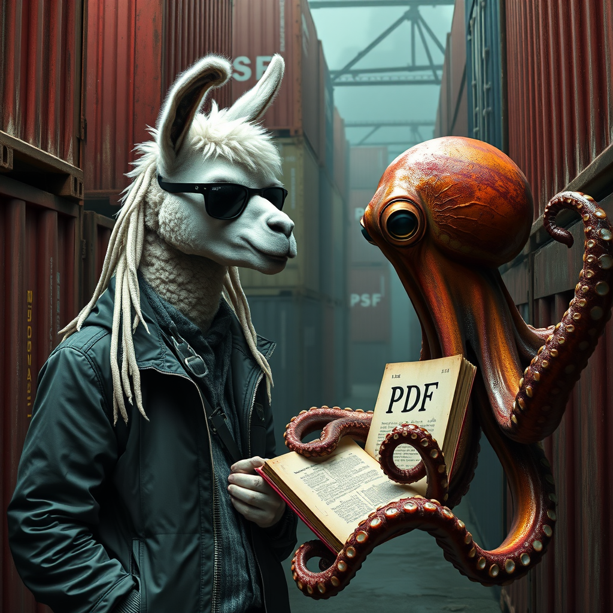

## RAG Project

This is my first project using AI. It's a simple RAG (Retrieval-Augmented Generation) model that utilizes a vector database. By querying the database, users can ask questions about the information provided to the system. To use this program, you first need to install Ollama on your computer.

---

**Architecture**
The architecture of this project consists of a simple program with separate backend and frontend services:
- **Backen**: This component handles the logic for processing PDF documents, determining whether OCR algorithms are needed, and interacting with Ollama models. It embeds the documents into ChromaDB and utilizes Ollama's LLM to query the documentation stored in the vector database collections. The API is built using the FastAPI framework.

-  **Frontend**: The frontend is a simple web service created with the FastAPI framework. It features two main sections: a chat window for interacting with the system, and a window for uploading documents and selecting or creating a new collection to store the documents.

---

> :memo: **Advice**: There are some programs you need to have installed on your computer before launching the project.

---

### Installing dependencies
The first dependency required to run this RAG program is Ollama. You can download it from the official website.

<a href="https://ollama.com/download" target="_blank">Ollama Website</a>

If you're using Linux, you can install it directly by running the following commands in your terminal:

#### Install Ollama and required Models
First, install ollama using the following command:
```bash
curl -fsSL https://ollama.com/install.sh | sh
```

Then, download the models required for this project by running the following commands:

```bash
ollama pull mistral-nemo
ollama pull mxbai-embed-large
```
Once Ollama and the necessary models are installed, you can download the project:

---

### Download project

Clone the repository with the following command:

```bash
git clone  https://github.com/CarlosChiva/RAG.git
```

Navigate to the project's main directory:


```bash
cd ~/RAG/
```

---

### Launch the Project

Initialize the program by running the command:

```bash
docker compose up -d
```

To interact with the program, visit the following URL

http://localhost:5000

<a href="http://localhost:5000" target="_blank">Project launched</a>

---

## Next Relases

 - [ ] Check out and Implement llama3.2 Vision to OCR system.
 - [ ] Add re-ranking models for extense documents in colleciton
 - [ ] Add window to multimodal RAG functionality
 
---



